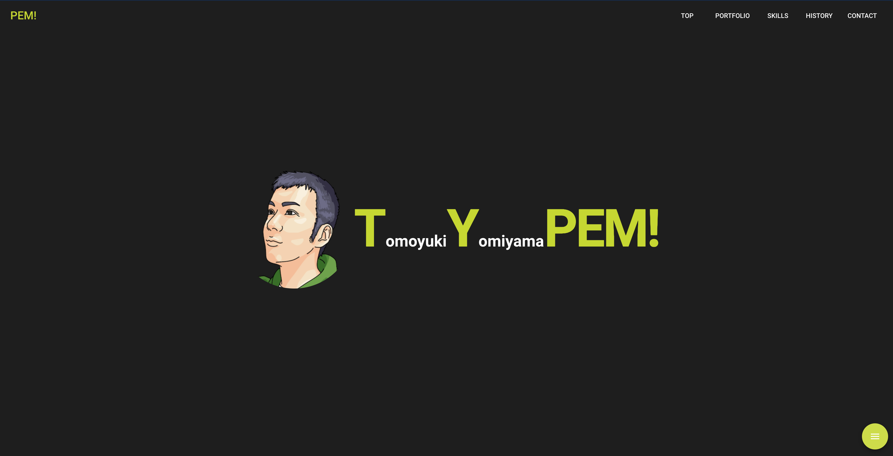

# Welcome My Site Summary
初めましてTOMOYUKI YOMIYAMAです。2018/6よりプログラムを毎日コツコツと勉強し、2019/4から転職活動をしております。
> [経歴詳細](https://peme-fdcbe.firebaseapp.com/#history)
### 当サイトは主に下記を用いました。

Vue.js, Vuetify (UI component), webpack, firebase

#### 意識した事と学んだ事

- **vue.js**の基本
- vue.js の **単一ファイルコンポーネント** の基本
- jQueryに頼らないイベントハンドリング
- よくある機能は実装する（スムーススクロール、マテリアルデザイン、インタラクティブであること）
- **firebase** でのデプロイ基本
- フォームの基礎。**バリデーション**や**メール転送**

#### 製作期間

4/15日時点で計40時間程。デザイン構想も含んでいます。

#### 今後追加する予定

4/15日現在**GoogleMap API**と**Rails API** と **Vue.js Vuex Vue Router**を用いたアプリケーションを作成中です。ポートフォリオの項目に追加する予定です。
> [Respect!地図に感謝と応援を残そう！](https://github.com/yomizo/respect-app)
